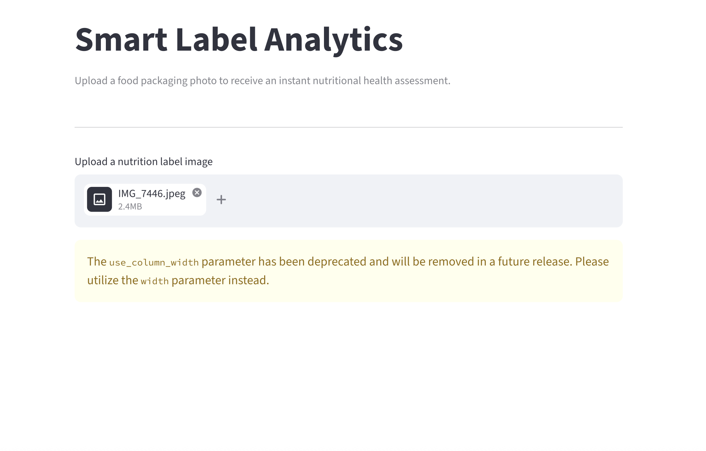
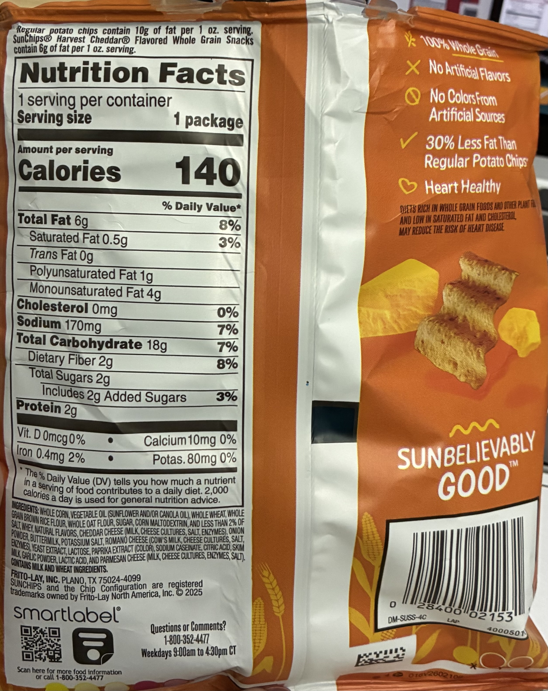
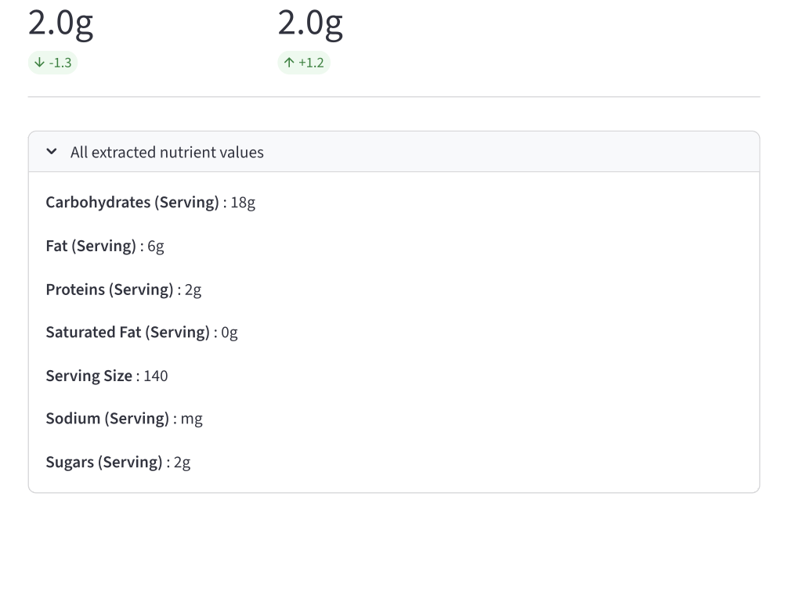

# Smart Label Analytics for Consumer Health
A computer vision and NLP pipeline that reads nutrition labels from food packaging images, extracts structured nutritional data, and generates health scores with consumer recommendations.

**Live Demo:** [Smart Label Analytics](https://smart-label-analytics-for-consumer-health-9mkcxot789fc4ao6fc6p.streamlit.app/)

## 1. Problem Statement:
Every packaged food product carries a nutrition label, yet most consumers either ignore it, cannot interpret it quickly, or struggle with multilingual labels while shopping. 
Manually reading and comparing values like saturated fat, sugar, fibre, and protein across products is tedious and requires nutritional knowledge most people don't have. 
This creates a gap between the information that exists on packaging and the ability of consumers to act on it in real time. The result is uninformed food choices that contribute to diet-related health issues including obesity, diabetes, and cardiovascular disease. 
There is a clear need for an automated system that can read nutrition labels from a photo, understand what the numbers mean, and instantly communicate whether a product is a healthy choice, without requiring any nutritional knowledge from the user.

## 2. Project Overview: 
The system that takes a photo of any food product packaging, automatically finds the nutrition facts table, extracts every nutrient value from it using a document AI model, and outputs a health score with a consumer-friendly recommendation. 
The system works across multilingual labels (English, French, German, and others), handles European decimal formats, and produces a transparent breakdown showing exactly why a product scored the way it did. 
The end goal is to guide consumers toward healthier product choices at the point of purchase, measurable as an increase in healthy product adoption among users who use the system versus those who don't.

**Core Idea:** 
1. Reading a nutrition label is a document understanding problem, not just an OCR problem.
The nutrient name sits on the left, the value sits on the right - plain OCR reads text
sequentially and loses that spatial relationship entirely.

2. LayoutLMv3 fixes this by processing text, position, and image simultaneously -
so it correctly links `3.6g` to `Fat` even across multilingual rows and whitespace.

3. The health scoring layer then converts those raw numbers into a single score,
grade, and one-line recommendation - so the consumer never needs to interpret
the numbers themselves.

## 3. Execution Pipeline: 
1. Image Input: User provides a photo of food packaging (camera photo, product scan, or dataset image)

2. Nutrition Table Detection: YOLOv8 model locates the nutrition facts table on the packaging and outputs a bounding box
         Dataset: openfoodfacts/nutrition-table-detection
   
         Output : coordinates of the table region

4. OCR: Tesseract extracts every word and number from the detected table region. Each token gets a pixel-level bounding box
         Output : list of tokens aand their 2D positions

5. Token Classification (LayoutLMv3): Fine-tuned transformer reads tokens + positions + image simultaneously and labels each token by nutrient type

   for instance:
   - "365"  : B-ENERGY_KCAL_100G
   - "kcal" : I-ENERGY_KCAL_100G
   - "3,6"  : B-FAT_100G
   
         Dataset: openfoodfacts/nutrient-detection-layout
         Output : structured dict of nutrient : value

7. Value Decoding:
   - BIO span decoder reconstructs full values from subword tokens,
   - Handles European comma decimals (3,6g → 3.6g),
   - Handles consecutive B- tags on same nutrient span

         Output : {ENERGY_KCAL_100G: 365, FAT_100G: 3.6, ...}

8. Health Scoring:
   - WHO/EU reference values applied per nutrient
   - Penalties for energy, saturated fat, sugars, salt
   - Bonuses for fibre and protein
   - Score clamped 0–100, mapped to Grade A–E

         Output : score, grade, per-nutrient breakdown

10. Consumer Report: Human-readable recommendation printed with visual progress bar, grade, and specific advice.

## 4. Skills:
- **Machine Learning & Deep Learning**: LayoutLMv3 fine-tuning, token classification, BIO tagging, YOLOv8 object detection, transfer learning

- **Natural Language Processing**: Named Entity Recognition (NER), subword tokenisation, token-label alignment, BIO span decoding

- **Computer Vision**: Bounding box detection, coordinate normalisation, OCR pipeline, multimodal fusion (text + layout + image)

- **Data Engineering**: HuggingFace Datasets, encoding pipelines, multilingual text handling, train/val/test split management

- **Evaluation**: seqeval (BIO-aware span-level F1), per-class precision/recall breakdown

- **Libraries & Tools**: HuggingFace Transformers, PyTorch, Ultralytics YOLOv8, Tesseract OCR, OpenCV, Pillow, Streamlit, Google Colab (T4 GPU)

## 5. Dataset Sources: 
Both datasets come from [Open Food Facts](https://world.openfoodfacts.org) - a non-profit, crowdsourced, open database of food products from 150 countries with 3 million products and 7 million packaging images, all under Creative Commons licence.
- [`openfoodfacts/nutrition-table-detection`](https://huggingface.co/datasets/openfoodfacts/nutrition-table-detection) 
  - 5,600 real packaging images with manually annotated bounding boxes marking 
  where the nutrition table appears. Used to train the detection model.
- [`openfoodfacts/nutrient-detection-layout`](https://huggingface.co/datasets/openfoodfacts/nutrient-detection-layout) 
  - 3,080 packaging images with token-level annotations labelling every nutrient 
  value using BIO tagging. OCR was pre-run using Google Cloud Vision. Used to 
  fine-tune LayoutLMv3.

---
## 6. Results

The model was trained for 12 epochs (~3,080 samples, T4 GPU, ~65 minutes) using
"microsoft/layoutlmv3-base" fine-tuned on the Open Food Facts nutrient detection
dataset. The architecture, pipeline, and scoring logic are production-ready -
scaling to "layoutlmv3-large" with extended training is the direct next step
documented under Future Improvements.

---

### Model Performance

F1 Score  : 0.71
Precision : 0.67
Recall    : 0.75
Loss      : 0.22

- **F1 Score (0.71)**, the headline metric. Measures how well the model balances finding nutrient values and labelling them correctly. A perfect model scores 1.0. At 0.71, the model correctly identifies and labels approximately 3 in every 4 nutrient values - a strong baseline for a proof-of-concept run on the base model.

- **Precision (0.67)** ,of every value the model flagged as a nutrient, 67% were genuinely nutrient values. The remaining 33% were false positives.
- **Recall (0.75)** of every nutrient value present in the image, the model successfully found 75% of them.
- **Loss (0.22)** the model's internal error during training. Lower is better. 0.22 reflects well-converged predictions for a base model run.

---

### Per-Nutrient Accuracy

The model performs strongest on the most clinically important nutrients -
energy, fat, and salt - which are the primary inputs to any health scoring system.

| Nutrient | F1 Score | Reliability |
|---|---|---|
| Energy (kcal) | 0.93 | Excellent |
| Energy (kJ) | 0.92 | Excellent |
| Fat | 0.85 | Excellent |
| Salt | 0.85 | Excellent |
| Saturated fat | 0.76 | Good |
| Protein | 0.74 | Good |
| Carbohydrates | 0.68 | Good |
| Fibre | 0.20 | Weak |
| Calcium / Iron / Vitamins | 0.00 | Not learned |

Fibre scores low due to high variation in how it is labelled across languages
(Fibre, Ballaststoffe, fibres alimentaires). Calcium, iron, and vitamins
appeared in fewer than 6 test samples - not enough for the model to learn a reliable
pattern. Both are addressable with additional training data.

---

### End-to-End Inference 

**Test 1 - Multilingual EU label (German / French / English)**

All 9 nutrient values extracted correctly after applying the custom BIO span decoder:

Energy          : 365 kcal  /  1546 kJ
Fat             : 3.6 g
Saturated fat   : 0.8 g
Carbohydrates   : 73.0 g
Sugars          : 1.1 g
Fibre           : 3.4 g
Protein         : 8.5 g
Salt            : <0.01 g

  ## SMART LABEL ANALYSIS: 

  
  Health Score : 54 / 100
  
  [██████████░░░░░░░░░░]
  Grade        : C
  Advice       : Moderate. Fine occasionally, watch portions.
  

  Nutrient breakdown (per 100g):

    Energy          : 365 kcal   (penalty  -8.2)
    Saturated fat   : 0.8g       (penalty  -1.3)
    Sugars          : 1.1g       (penalty  -0.7)
    Salt            : 0.0g       (penalty  -0.1)
    Fibre           : 3.4g       (bonus    +9.1)
    Protein         : 8.5g       (bonus    +5.1)

The product scores Grade C - a calorie-dense grain-based product whose high fibre
(3.4g) and solid protein (8.5g) partially offset its energy density. A consumer
receives this report in seconds from a single photo, with no nutritional knowledge
required.

---

**Test 2 - US format label (SunChips, Harvest Cheddar)**

Tested via the live Streamlit app on a real US product image:

~~~
Carbohydrates (Serving) : 18g
Fat (Serving)           : 6g
Proteins (Serving)      : 2g
Saturated Fat (Serving) : 0.5g
Serving Size            : 140
Sodium (Serving)        : mg   ← value missed (see note below)
Sugars (Serving)        : 2g

Health Score : 50 / 100
Grade        : C
Advice       : Moderate. Fine occasionally, watch portions.

~~~

**Note on Sodium extraction:** The sodium value (170mg) was not fully extracted -
the model captured the unit "mg" but missed the number '170'. This is a known
Tesseract OCR limitation: the model was trained on Google Cloud Vision tokens,
which tokenise numbers and units differently from Tesseract. Replacing Tesseract
with Google Cloud Vision at inference time is expected to resolve this and is
documented under Future Improvements.

---

## 7. Challenges Encountered: 
- **Decimal value decoding** : European decimals like `3,6g` were split by the tokeniser into ["3", ",", "6", "g"]. The decoder treated each "B-" tag as a new value, reading "3,6" as just "6". Fixed with a custom decoder that treats consecutive "B-" tags on the same nutrient as a single span.

- **OCR quality gap** : Tesseract extracted 4 out of 9 nutrients on a real image. The model was trained on Google Cloud Vision tokens - switching to the dataset's own pre-computed tokens gave all 9 values correctly. Root cause: different OCR engines tokenise the same text differently.

- **Subword tokenisation and label alignment**: LayoutLMv3 uses a subword tokeniser - one word becomes multiple tokens. Only the first subword gets the real label; the rest get "-100" (ignored in loss). Required careful use of word_labels in the processor to handle this alignment correctly.

- **Multilingual label noise** : The image contained German, French, and English on the same panel. The tokeniser produced garbled characters for German umlauts and French accented characters. These were all correctly predicted as O (non-nutrient) but added noise to the token stream.

## 8. Future Enhancements and Improvements: 

- **Model** : witch `layoutlmv3-base` → `layoutlmv3-large` for improved accuracy. Train for 15–20 epochs with early stopping. Oversample rare nutrient classes (calcium, iron, vitamins) to address zero F1 on low-support labels.

- **OCR** : Replace Tesseract with Google Cloud Vision API - the model was trained on GCV tokens, making it the natural inference-time OCR choice. This directly addresses the sodium extraction issue observed in live testing. Add preprocessing (deskew, contrast enhancement, perspective correction) for curved or low-light packaging photos.

- **Health Scoring** : Implement the official Nutri-Score EFSA algorithm with category-specific thresholds (solid foods vs beverages scored differently). Integrate NOVA group classification from the Open Food Facts API to flag ultra-processed products regardless of nutrient score.

- **Pipeline** : Connect YOLOv8 detection end-to-end so the system works on raw unprocessed packaging photos, not pre-cropped table images.

- **Data & Generalisation** : Add barcode scanning to fetch full product records (ingredients, allergens, Eco-Score) from the Open Food Facts API. Fine-tune on a multilingual tokeniser to improve robustness on non-Latin scripts and additional European languages.

---

## 9. Deployment

The app is deployed on Streamlit Community Cloud and loads the trained model directly from HuggingFace Hub.

**Live app:** [Smart Label Analytics](https://smart-label-analytics-for-consumer-health-9mkcxot789fc4ao6fc6p.streamlit.app/)

**Model on HuggingFace:** [lavanyakapoor/smart-label-model](https://huggingface.co/lavanyakapoor/smart-label-model)

**Source code:** [GitHub Repository](https://github.com/lavanya-kapoor/Smart-Label-Analytics-for-Consumer-Health)

### To run locally: 

~~~~
# Step 1 : clone the repository: g
it clone https://github.com/lavanya-kapoor/Smart-Label-Analytics-for-Consumer-Health.gitcd Smart-Label-Analytics-for-Consumer-Health

# Step 2 : create and activate virtual environment:
python3 -m venv venv
source venv/bin/activate        # Mac/Linux
venv\Scripts\activate           # Windows

# Step 3 : install dependencies:
pip install -r requirements.txt

# Step 4 : install Tesseract (Mac):
brew install tesseract

# Step 5 : run the app: 
streamlit run app.py
~~~~

### Project structure

~~~~
smart-label-analytics/
├── app.py                 [Streamlit web application]
├── requirements.txt       [Python dependencies]
├── packages.txt           [System dependencies (Tesseract for Streamlit Cloud)]
└── README.md
~~~~

> The trained model (~481MB) is hosted on HuggingFace Hub and loaded automatically 
> at app startup. It is not stored in the repository.

---

## References

- Open Food Facts : [openfoodfacts.org](https://world.openfoodfacts.org)
- WHO Europe : nutrient reference values for food labelling
- HuggingFace : [openfoodfacts/nutrient-detection-layout](https://huggingface.co/datasets/openfoodfacts/nutrient-detection-layout)
- HuggingFace : [openfoodfacts/nutrition-table-detection](https://huggingface.co/datasets/openfoodfacts/nutrition-table-detection)
